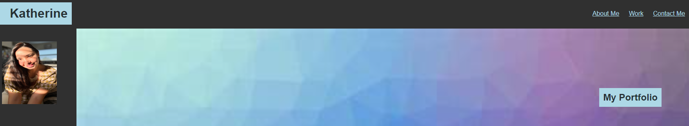

TITLE:

Advanced CSS Challenge - Create a Professional Portfolio

DESCRIPTION:

This challenge was to create a sample, professional portfolio which will be updated throughout the course of the bootcamp to showcase
my knowledge and skills.

ACCEPTANCE CRITERIA:

There are 5 things to clean-up in both the HTML & CSS:

My portfolio page has my name, a recent photo or avatar, and links to sections about me, my work, and how to contact me.

The UI scrolls to the corresponding section from the links in the navigation bar
    
The UI scrolls to a section with titled images of the developer's applications when the user clicks on the link to the section about my work

The first application's image should be larger in size than the others when clicked
 
The user is taken to that deployed application when the images of the application

I am presented with a responsive layout that adapts to my viewport when I resize the page or view the site on various screens and devices

TASKS COMPLETED:

There are About Me, My Work, and Contact Info sections

There are functioning navigation links at the top of the page to take the user to any of the sections

I included a recent photo of myself.

The projects presented in the My Work section include a couple of sample programs I have worked on for the bootcamp as well as some placeholder applications for projects TBD

The non-placholder applications will take the user to the deployed application on my GitHub when clicked on.
T
he page was styled for multiple screen sizes, including tablets and mobile phones.

CREDITS:

While this job was peformed with care by yours truly, I cannot let the assistance of my classmates, AI, learning assistants, TAs, and professor go unnoticed.

I look forward to your feedback. Be brutal.

LICENSE:

@oneday

BADGES & GADGETS:

TBD

FEATURES: 

Lots of Ctrl Z

TESTS:

My patience and my sanity   

LINK:

 https://katvela24.github.io/Katherine-Portfolio/

SCREENSHOT:

 